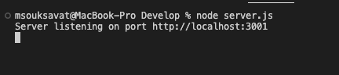
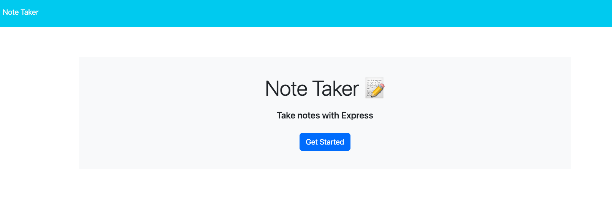
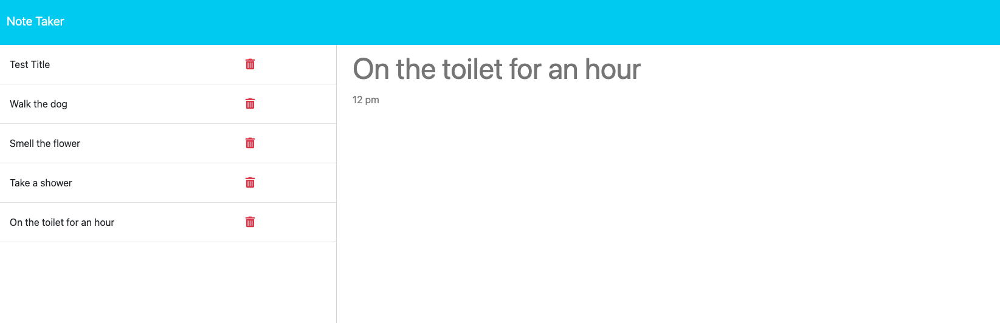

# Taking Notes! 

### Deployed Application (Heroku) : https://secure-ocean-96489.herokuapp.com/ 

### Github : https://github.com/kevinl206/TakingNotes.git

## Table of Contents
- [Description](#description)
- [Installation](#installation)
- [Github](#github)
- [Email](#email)
- [Questions](#questions)
  
## Description
    This application is made to help users to keep track of their progress through the day. The user can write, save and retrieve
    their notes. This application was developed by using express.js.
[Back to top](#)
  
## Installation
- Download and install "NPM install".
- Then run "node server.js" in your terminal.

- You will need to make sure your URL is live "https://localhost:3001"

[Back to top](#)
  
## Screenshot of Example

[Back to top](#)
  
 ## Email
      kevinl206@yahoo.com
[Back to top](#)
  
## Questions
  any additional questions, feel free to reach out to me via [email](mailto:kevinl206@yahoo.com).